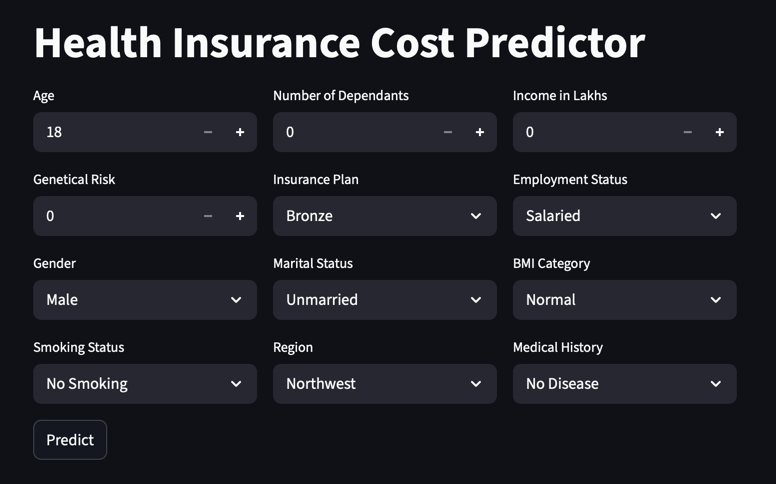

# 🧠 Health Insurance Premium Prediction

A predictive machine learning model to estimate health insurance premiums based on user attributes such as age, BMI, smoking status, and medical history.  
Developed as part of an MLOps-focused portfolio project, it includes training notebooks, model artifacts, a Streamlit web interface, and is cloud-deployment ready.

[](https://insurance-cost-predictor.streamlit.app/)

---

## 🚀 Key Features

- ✔️ Supervised ML models trained on real insurance data
- 🧪 Data segmentation: youth vs adults, with/without genetic risk
- 📦 Serialized models and scalers for reproducibility
- 🌐 Streamlit interface for real-time prediction
- 📁 Modular and clean repository layout

---

## 🖼️ Live App Preview



---

## 📊 Modeling Strategy & Results

We initially trained and evaluated multiple models on the full dataset (`premiums.xlsx`):

| Model              | Train Score | Test Score | RMSE     |
|-------------------|-------------|------------|----------|
| Linear Regression | 0.9282      | 0.9280     | 2272.80  |
| Ridge Regression  | 0.9282      | 0.9280     | 2272.81  |
| XGBoost           | 0.9782      | 0.9782     | 1250.22  |
| XGBoost + Tuning  | 0.9809      | 0.9809     | —        |

### 🔍 Error Analysis

- **30% of predictions** had a deviation greater than ±10%.
- These *extreme errors* were **mostly concentrated in younger customers (< 25 years old)**.
- Based on the age distribution and error segmentation, we decided to split the data into:
  - **Youth (≤25)** and
  - **Adults (>25)**

---

### 🧠 Segmented Modeling Results

#### 📈 Adults
| Model         | Test Score | Extreme Errors |
|---------------|------------|----------------|
| XGBoost       | 0.9948     | 0.3%           |
| Ridge         | 0.9538     | —              |

➡️ Performance is excellent; no further refinement needed.

#### 📉 Youth
| Model                  | Test Score | Extreme Errors |
|------------------------|------------|----------------|
| Linear Regression      | 0.6048     | 73%            |
| XGBoost                | 0.5997     | 73%            |

➡️ Poor generalization. No clear pattern from existing features.

---

### ➕ Feature Addition (Genetical Risk)

- Business provided a new feature: `genetical_risk` (for youth segment).
- After retraining with `genetical_risk`:

| Model                  | Test Score | Extreme Errors |
|------------------------|------------|----------------|
| Linear Regression      | 0.9887     | 2%             |
| XGBoost                | 0.9879     | 2%             |

✅ Linear Regression was selected for its explainability.

---

### 💾 Deployment Strategy

- Models serialized using `joblib` for consistent loading
- `scaler` objects exported alongside each model
- Unified prediction interface handles both age groups internally

## 🗂️ Project Structure

```bash
insurance-premium-prediction/
├── .github/
│   └── workflows/
│       └── ci.yml                 # GitHub Actions CI workflow
├── app/                           # Streamlit web app
│   ├── main.py
│   └── prediction_helper.py
├── artifacts/                     # Trained models + visual assets
│   ├── model_adults.joblib
│   ├── model_youth.joblib
│   ├── scaler_adults.joblib
│   ├── scaler_youth.joblib
│   └── live_app.png               # Screenshot for live app
├── data/
│   └── raw/                       # Raw Excel files used for training
│       ├── premiums.xlsx
│       ├── premiums_adults.xlsx
│       ├── premiums_youth.xlsx
│       └── premiums_youth_with_gr.xlsx
├── notebooks/                    # Jupyter notebooks (EDA, training)
│   ├── 01_global_model_training.ipynb
│   ├── 02_data_segmentation.ipynb
│   ├── 03_model_training_youth.ipynb
│   ├── 04_model_training_adults.ipynb
│   ├── 05_model_training_youth_with_genetical_risk.ipynb
│   └── 06_model_training_adults_with_genetical_risk.ipynb
├── tests/                         # Unit tests (pytest)
│   └── test_prediction.py
├── .gitignore
├── requirements.txt               # Python dependencies
├── LICENSE
└── README.md

